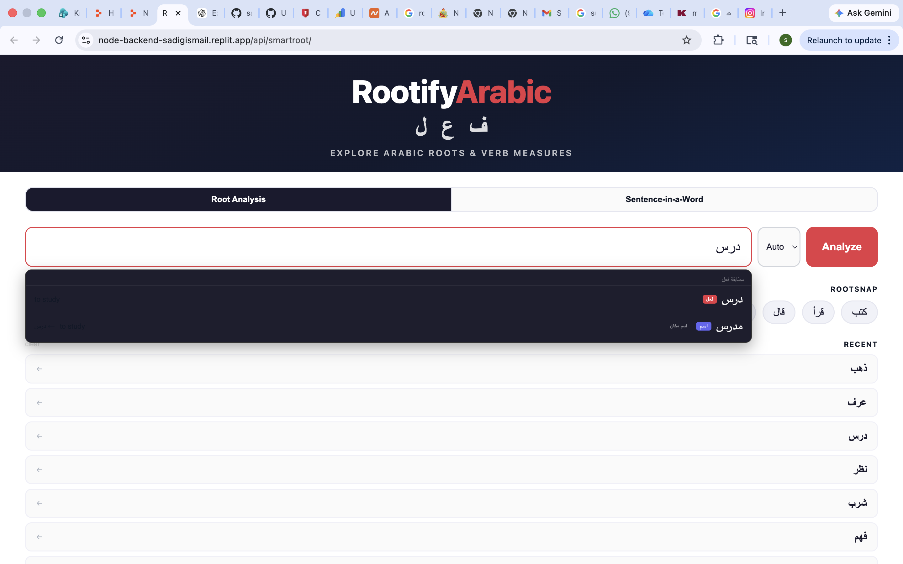
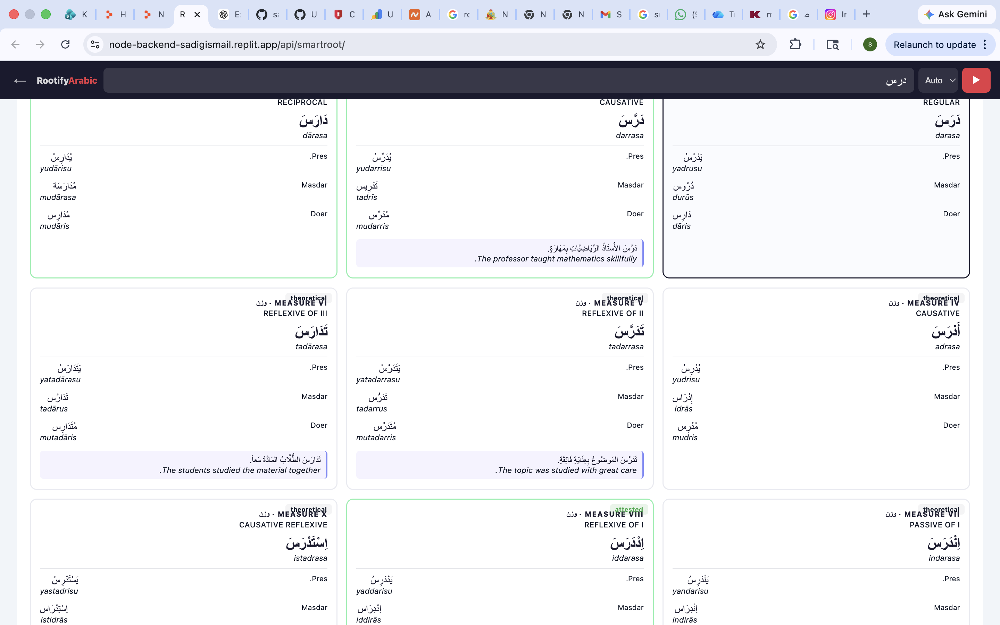
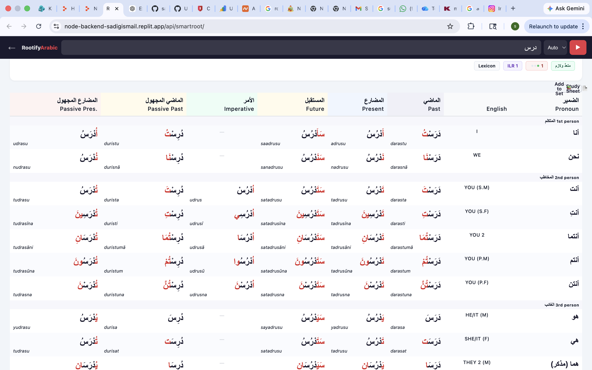

# 🧠 RootifyArabic — Arabic Morphology Engine

---
Analyze Arabic roots...

---

## ✨ What You Can Do

- 🔍 **Analyze Arabic roots instantly**
- 🧠 **Detect verb forms (Form I–X)**
- ⚙️ **Generate full conjugations**
- 🧩 **Handle weak verbs (defective, hollow, assimilated)**
- 🔄 **Switch between active & passive voice**
- 📊 **Get linguistic breakdowns for learning and analysis**
---
## ⚙️ How It Works

1. ✍️ Enter an Arabic word or sentence  
2. 🔍 The engine detects the root and verb form  
3. ⚙️ It generates conjugations and linguistic features  
4. 📊 You get a structured analysis instantly  

---
## 🧠 Overview
RootifyArabic is an advanced Arabic morphology engine designed to analyze roots, detect verb forms, and generate accurate conjugations.
It is built to support Arabic language learners, linguists, and AI-driven language tools by providing precise and scalable morphological analysis.
## ✨ Features
- Smart root detection
- Full conjugation engine
- Arabic verb classification system (Form I–X)
- Support for weak verbs (defective, hollow, assimilated)
- Passive and active voice generation
- Linguistic analysis pipeline
## 🛠 Tech Stack
- Node.js
- TypeScript
- Custom Arabic Morphology Engine
## 📁 Project Structure
- `/lib` → core logic
- `/data` → lexicons
- `/scripts` → utilities
- `/artifacts` → builds
- `/attached_assets` → resources
## 📸 Screenshots
### 🔍 Morphological Analysis Interface

### 🧠 Root Detection & Verb Classification

### 📊 Conjugation Engine Output

## 🎯 Purpose
This project aims to support:
- Arabic language learners
- Linguists
- AI-based language tools
- Educational platforms
## 👤 Author
Elsadig Suliman  
Arabic Linguist | Educator | AI Language Tools Developer
